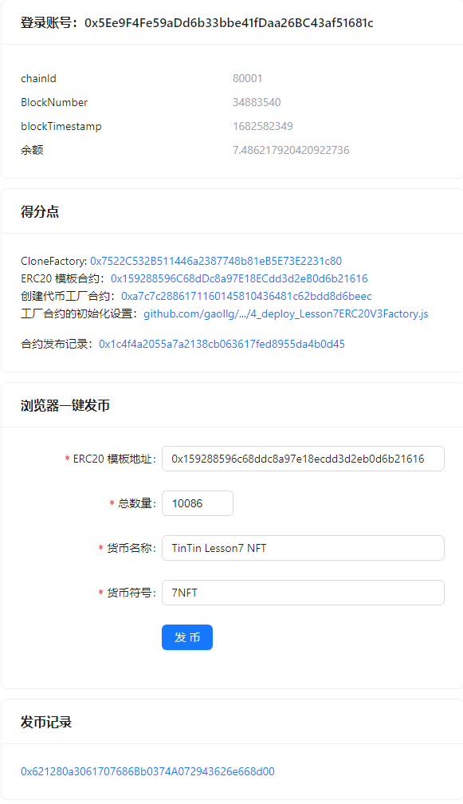

# tintin-lesson-7

<a href="https://mumbai.polygonscan.com/address/0x7522C532B511446a2387748b81eB5E73E2231c80#code"  target="_blank">0x7522C532B511446a2387748b81eB5E73E2231c80</a>

### 在线预览
在线预览：<a href="https://gaollg.github.io/tintin-lesson-7/web/dist/index.html">https://gaollg.github.io/tintin-lesson-7/web/dist/index.html</a>

### 合约地址：

CloneFactory: <a href="https://mumbai.polygonscan.com/address/0x7522C532B511446a2387748b81eB5E73E2231c80#code"  target="_blank">0x7522C532B511446a2387748b81eB5E73E2231c80</a>

ERC20 模板合约: <a href="https://mumbai.polygonscan.com/address/0x159288596C68dDc8a97E18ECdd3d2eB0d6b21616#code" target="_blank">0x159288596C68dDc8a97E18ECdd3d2eB0d6b21616</a>

创建代币工厂合约: <a href="https://mumbai.polygonscan.com/address/0xa7c7c2886171160145810436481c62bdd8d6beec#code" target="_blank">0xa7c7c2886171160145810436481c62bdd8d6beec</a>

工厂合约的初始化设置：<a href="https://github.com/gaollg/tintin-lesson-7/blob/main/truffle/migrations/4_deploy_Lesson7ERC20V3Factory.js" target="_blank">4_deploy_Lesson7ERC20V3Factory.js</a>

### 合约发布记录

<a href="https://mumbai.polygonscan.com/address/0x1c4f4a2055a7a2138cb063617fed8955da4b0d45" target="_blank">0x1c4f4a2055a7a2138cb063617fed8955da4b0d45</a>
