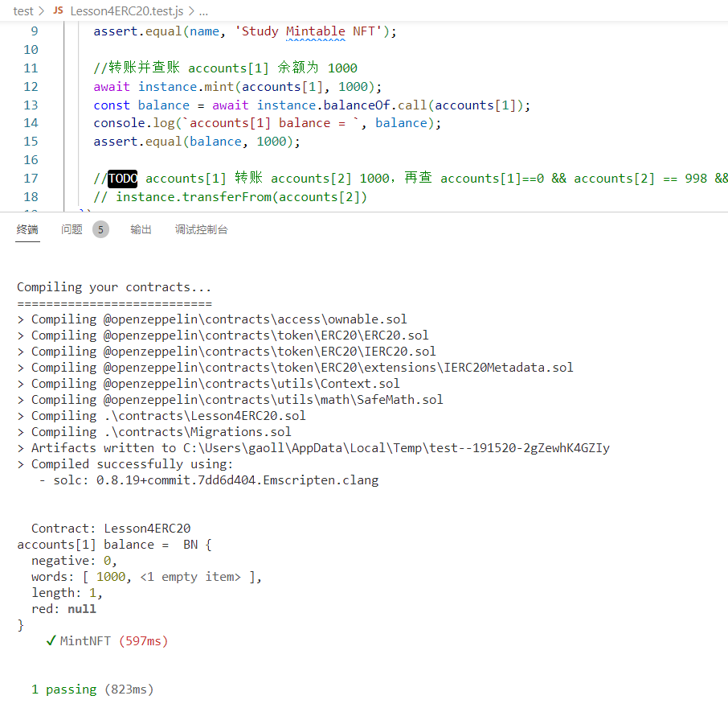
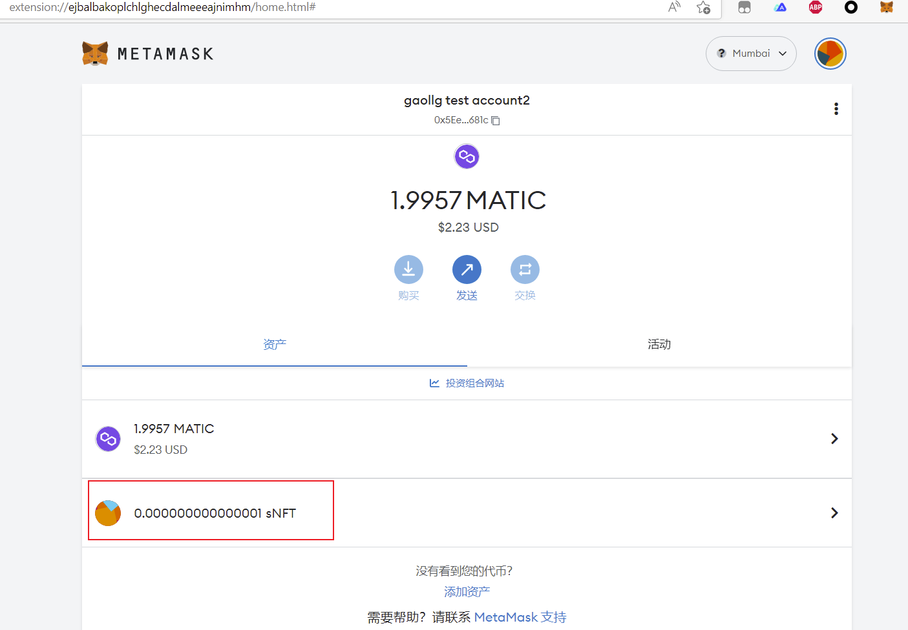

# 1、单元测试结果



# 2、合约

合约地址：https://mumbai.polygonscan.com/address/0xab741a75f7b52b5475733ebd5e61a1be781613e6

Mint: https://mumbai.polygonscan.com/tx/0xf0f68403ace28e364d35c82c0ebd1a3437fc43efc89eaa3a40f73843433722dd


学习币(study NFT)



# 命令行

```bash
truffle micrate --network development
```

```bash
truffle micrate --network mumbai
```

```base
truffle test ./test/Lesson4ERC20.test.js
```
