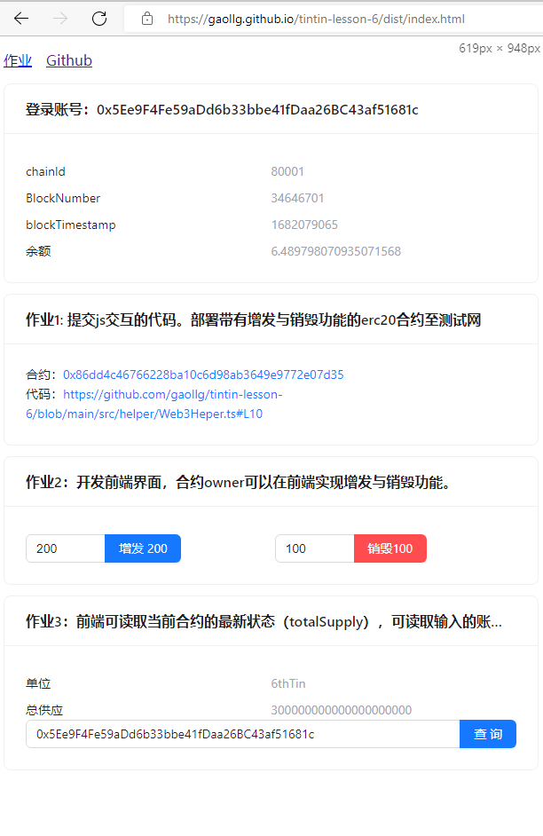

# tintin-lesson-6

# 作业1: 提交js交互的代码。部署带有增发与销毁功能的erc20合约至测试网

合约：<a href="https://mumbai.polygonscan.com/address/0x86dd4c46766228ba10c6d98ab3649e9772e07d35#code" target="_blank">0x86dd4c46766228ba10c6d98ab3649e9772e07d35</a>
代码：<a href="https://github.com/gaollg/tintin-lesson-6/blob/main/src/helper/Web3Heper.ts#L10" target="_blank">https://github.com/gaollg/tintin-lesson-6/blob/main/src/helper/Web3Heper.ts#L10</a>

# 作业2：开发前端界面，合约owner可以在前端实现增发与销毁功能。/ 作业3：前端可读取当前合约的最新状态（totalSupply），可读取输入的账户地址当前余额。

在线预览 <a href="https://gaollg.github.io/tintin-lesson-6/dist/index.html">https://gaollg.github.io/tintin-lesson-6/dist/index.html</a>

